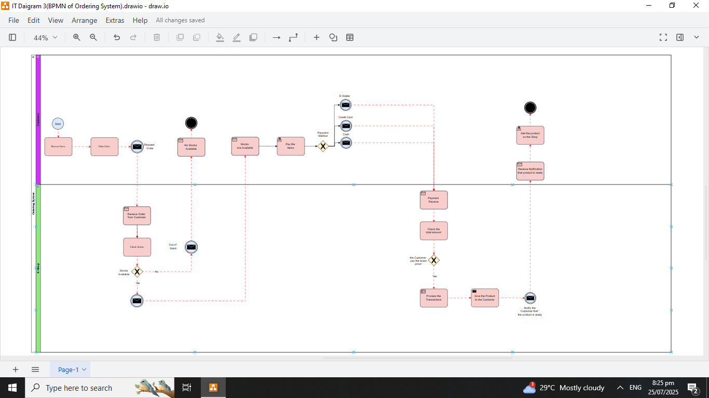

# IT-Diagramming-Ordering-System
## Description
This project demonstrates a complete IT Diagram setup using:
- **7 Start**
- **13 Task**
- **2 Gateway**
- **2 End Event**
- **27 Flow**

The diagram includes **Shapes**, **Legends**, **Styles**, and **Connections between shapes** . Designed and Visualized using **Draw.io**, this setup is ideal for learning how to design Business Process Modeling and Notation for Ordering System via online.

---

## Project Objectives
- Map the Flow of Ordering System.
- Visualize the Process of Ordering System.
- Implement the usage of the different types of events and task.

---

## Repository Contents

# Styles/
- **Start.txt**
- **Task.txt**
- **Gateway.txt**
- **End Event.txt**
- **Flow.txt**

# Overview 

# IT Diagram Source File/
- **IT Diagrams 3 (Ordering System).drawio**
  
# README.md

## Tools Used
- **Draw.io** – for System Design
- **Text Editor** – for writing and reviewing Shape Styles 

---

## How to Use
1. Open the `IT Diagrams 3 (Ordering System).drawio` file using **Draw.io**.
2. Check the Shapes if properly connected.
3. try to move shape's and edit the text and appearance of the shapes.

---

## Author
**[ITArchitect111](https://github.com/ITArchitect111)**  
BS in Information Systems – Isabela, Philippines  
**TikTok**: [@it_ako123](https://www.tiktok.com/@it_ako123)

---

## License
This project is provided for educational purposes only.  
Feel free to fork or adapt it with proper credit.

