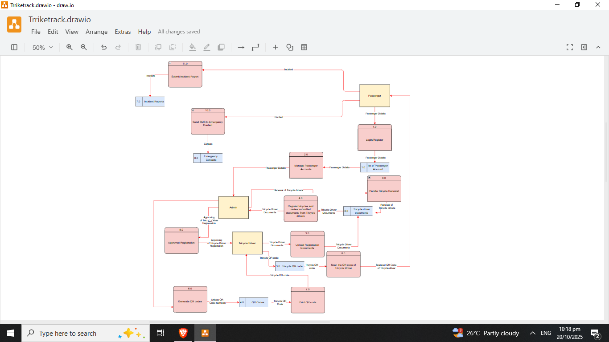

# IT-Diagramming-TrikeTrack
## Description
This project demonstrates a complete IT Diagram setup using:
- **11 Process**
- **7 Data Store**
- **3 Entity**
- **21 Flows**

The Data Flow Diagram serves as a Visualization of TrikeTrack a systemthst has QR Code base for Registration of Tricycle and Tracking with SMS Alert. Tricyle Driver can submit documents needed for their license and use the QR code generated by admin and use that QR code for their contact informations, Passengers can Create and Login their account, Enter their Emergency Contact number, scan the QR code of the Tricycle Driver, submit report and the system will automaitcally send a sms to the emergency contact that entered by the passenger that includes the incident report alongside the QR code of Tricycle driver, and Admin manage Passenger Account,Genearte QR code for the Tricycle Drivers, Approved the registration of the Tricycle driver base on their submitted documents, and Handle renewal processess and monitor the expiration of the License of the Tricycle Drivers.

---

## Project Objectives
- Establish a digital platform for managing tricycle driver registration and license processing.
- Drivers can upload required documents for approval and future renewal.
- Administrators review, approve, or reject driver registrations and handle license renewals efficiently.
- A unique QR code is generated for every approved tricycle driver for identification and tracking purposes.
- Passengers create an account, log in, and provide emergency contact details within the system.
- QR codes can be scanned by passengers to access driver information and submit incident reports.
- Incident or complaint reports submitted by passengers automatically trigger an SMS alert to their registered emergency contact, including driver QR information and incident details.
- Automated notifications remind drivers and administrators of upcoming license expirations and required renewals.
- Administrators manage passenger accounts, driver profiles, QR code issuance, and monitoring of license validity.
- Accurate, secure, and organized records of drivers, passengers, tricycles, and submitted reports are maintained.
- Increased transparency and accountability in tricycle transportation services are promoted.
- The system centralizes operations, enhances safety, and improves monitoring of tricycle activities.

---

## Repository Contents

# Styles/
- **Process.txt**
- **Entity.txt**
- **Data Store.txt**
- **Flow.txt**

# Overview 

# IT Diagram Source File/
- **IT Diagrams 4 (TrikeTrack).drawio`**
  
# README.md

## Tools Used
- **Draw.io** – for System Design
- **Text Editor** – for writing and reviewing Shape Styles 

---

## How to Use
1. Open the `IT Diagrams 4 (TrikeTrack).drawio` file using **Draw.io**.
2. Check the Shapes if properly connected.
3. try to move shape's and edit the text and appearance of the shapes.

---

## Author
**[ITArchitect111](https://github.com/ITArchitect111)**  
BS in Information Systems – Isabela, Philippines  
**TikTok**: [@it_ako123](https://www.tiktok.com/@it_ako123)

---

## License
This project is provided for educational purposes only.  
Feel free to fork or adapt it with proper credit.

